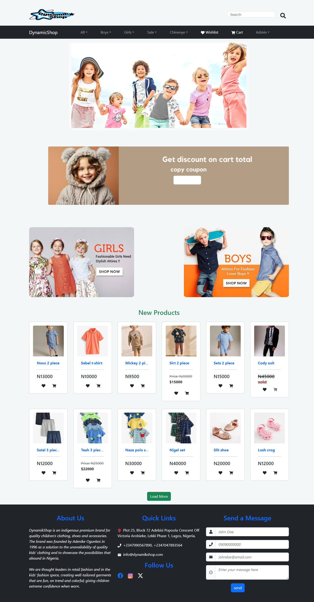

# dynamikShop



## Project Overview

dynamikShop is a revolutionary e-commerce web application designed to provide an unparalleled online shopping experience for both customers and businesses.It aims create an intuitive user friendly interface, optimized for both desktop and mobile devices, guaranteeing a seamless shopping experience .

### Built With
- [vite](https://vitejs.dev/guide/)
- Nodejs
- Expressjs
- HTML
- CSS
- MongoDb
- Redux toolkit
- Bootstrap css

## Getting Started

To get started with this project, follow the steps below:

### Prerequisites

- You will need a Google OAUTH API key for google authentication.
- Set your mail  credentials  in the `.env` file.
- set your cloudinary credentials for picture upload.
- set your flutterwave credentials for card payment.

### Installation

1. Clone the repository.
   ```sh
   git clone https://github.com/ChinenyeNmoh/dynamicShop.git
   ```
2. Install the required packages.
	```sh
	npm install package.json
	```
    run this in both the backend and the frontend folder

3. Configure your .env file with your Google OAUTH keys, facebook keys, paypal keys,  email and password credentials, cloudinary credentials and flutterwave credentials
	```sh
	PORT=YOUR_PORT 
    MONGO_URI=YOUR_MONGO_URI
    GOOGLE_CLIENT_ID=GOOGLE_CLIENT_ID
    GOOGLE_CLIENT_SECRET=GOOGLE_CLIENT_SECRET
    FACEBOOK_APP_ID=FACEBOOK_APP_ID
    FACEBOOK_APP_SECRET=FACEBOOK_APP_SECRET
    BASE_URL =BASE_URL
    HOST=EMAIL_HOST
    SERVICE=EMAIL_SERVICE
    PASS=GOOGLE_APP_PASSWORD
    USER=MAIL_USERNAME
    CLOUD_NAME=CLOUDINARY_NAME
    API_KEY=CLOUDINARY_API_KEY
    CLOUD_API_SECRET=CLOUDINARY_API_SECRET
    PUBLIC_KEY=FLUTTERWAVE_PUBLIC_KEY
    SECRET_KEY=FLUTTERWAVE_SECRET_KEY
    ENCRYPTION_KEY=FLUTTERWAVE_ENCRYPTION_KEY
    PAYPAY_ID=PAYPAY_ID
    PAYPAL_SECRET_KEY=PAYPAL_SECRET_KEY

	```
### Start the application for development.
   ```sh
   npm run dev
   ```

### preparing for deployment.
   ```sh
   npm run build
   ```
To learn more about deploymeny, [see this](https://vitejs.dev/guide/static-deploy.html)

### Contributing
We welcome contributions from the community. If you have suggestions to make this project better, please create a pull request or open an issue with the "enhancement" tag. Don't forget to star the project if you find it useful!

License
This project is licensed under the MIT License - see the LICENSE file for details.

## Author
- Chinenye Nmoh [Github](https://github.com/ChinenyeNmoh/) / [Linkedin](https://www.linkedin.com/in/chinenye-nmoh-88479699/) / [Email](chinenyeumeaku@gmail.com) 

